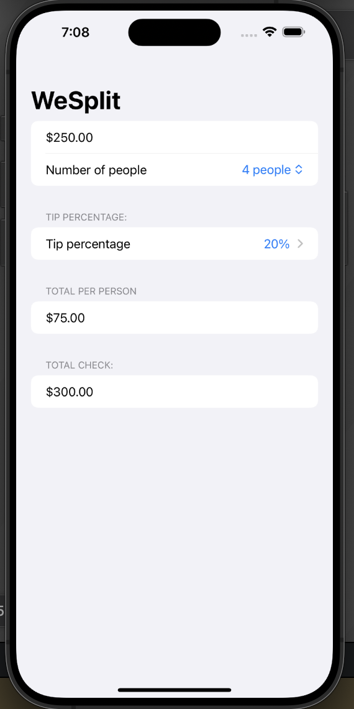
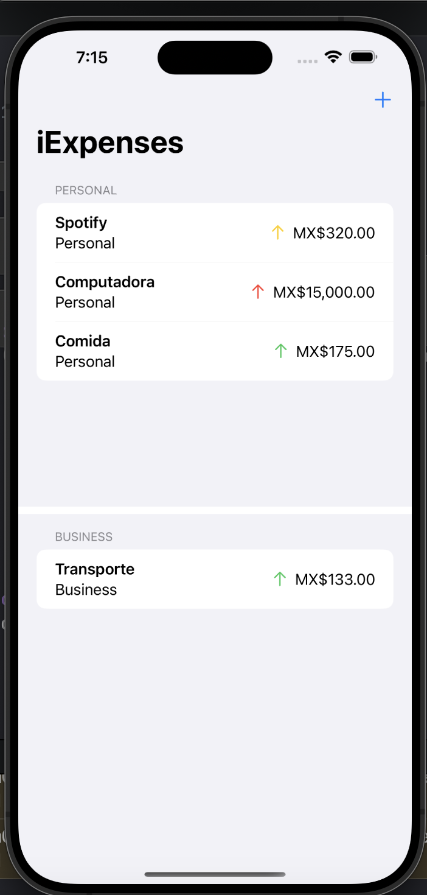
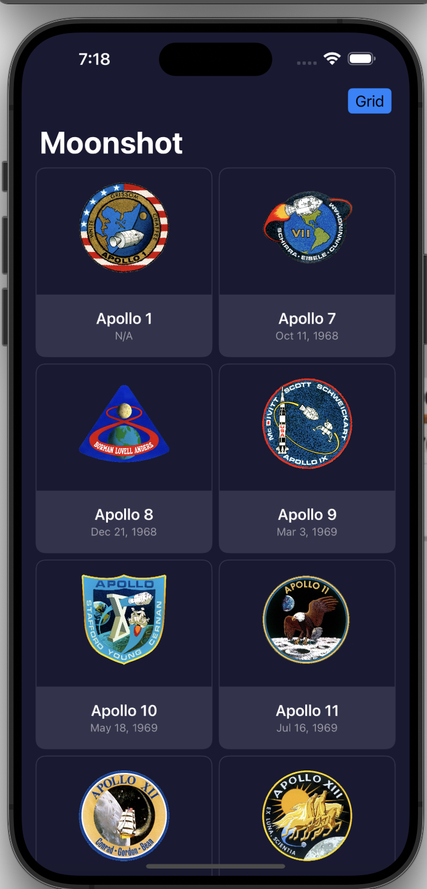

# 100 Days of SwiftUI

Following [Hacking with Swift — 100 Days of SwiftUI](https://www.hackingwithswift.com/100/swiftui), a comprehensive, project-based curriculum covering modern iOS development.

---

## 📌 Course Coverage

The program combines daily theory, challenges, and real apps to provide hands-on experience with:

- **Swift language fundamentals** — optionals, protocols, extensions, closures, generics, error handling.  
- **SwiftUI essentials** — layouts, state management (`@State`, `@Binding`, `@ObservedObject`), forms, navigation, lists.  
- **Persistence** — `UserDefaults`, Codable, and local data storage.  
- **Networking** — working with `URLSession`, JSON decoding, and building API-driven forms.  
- **Architecture** — MVVM patterns using SwiftUI property wrappers and data flow.  
- **iOS ecosystem** — alerts, gestures, animations, haptics, and integration with system features.  

---

## 🖼️ Projects

| WeSplit | iExpense | Moonshot |
|---|---|---|
|  |  |  |

---

## 🧭 Learning Approach

- Project-based learning: each module builds a functional app.  
- Incremental challenges: apply concepts immediately in small exercises.  
- Focus on practical iOS development skills applicable to real projects.  

---

## 📚 Reference

- [100 Days of SwiftUI](https://www.hackingwithswift.com/100/swiftui) by Paul Hudson
